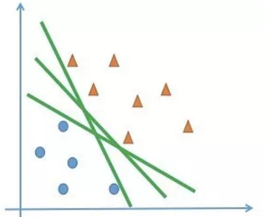
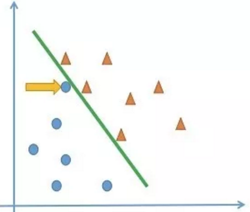
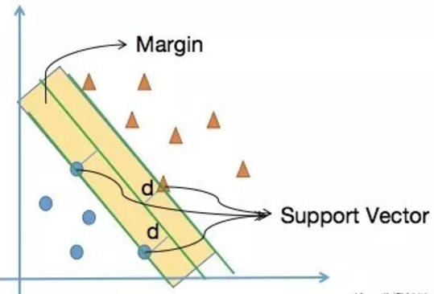
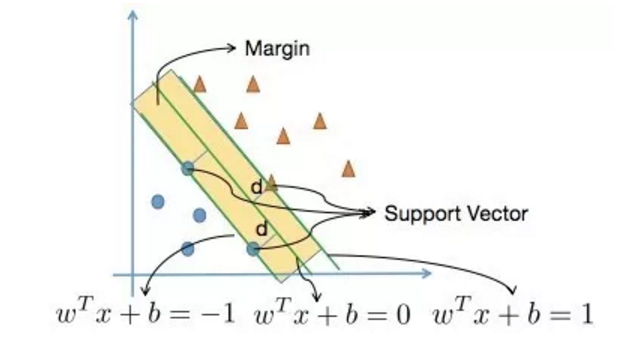
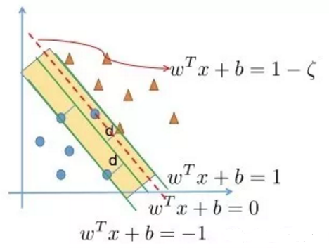
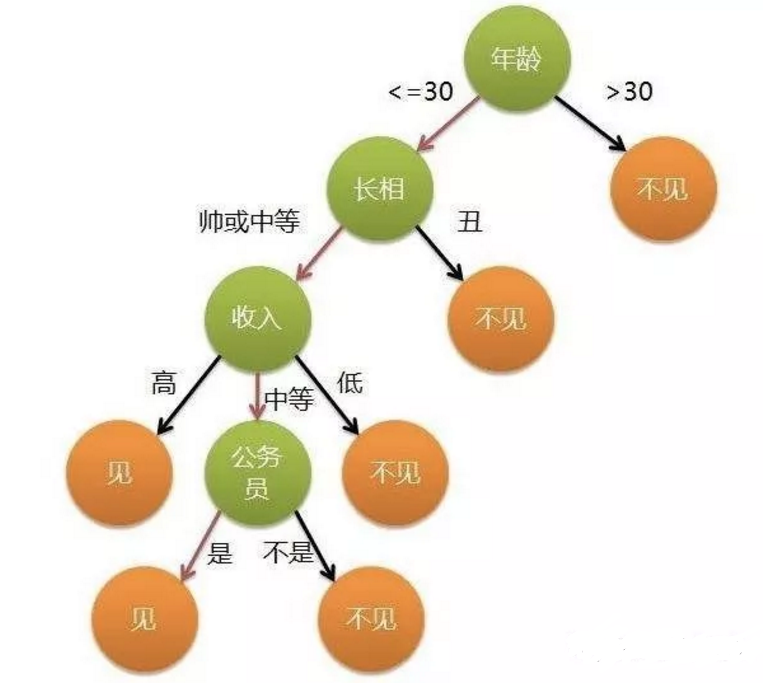

# 1.4 Machine Learning Model

机器学习模型按照可使用的数据类型分为监督学习和无监督学习两大类。

* 监督学习主要包括用于分类和用于回归的模型：

> 1）**分类**：线性分类器（如LR)、支持向量机（SVM）、朴素贝叶斯（NB）、K近邻（KNN）、决策树（DT）、集成模型（RF/GDBT等）
> 2）**回归**：线性回归、支持向量机（SVM）、K近邻（KNN）、回归树（DT）、集成模型（ExtraTrees/RF/GDBT）

* 无监督学习主要包括：数据聚类（K-means）/ 数据降维（PCA）等等.

本节我们简单介绍LR,SVM,DT等3个基础分类器的原理和python实现。

## 1\) LR

逻辑回归（Logistic Regression，LR）。在Kaggle竞赛的统计中，LR算法以63.5%的出产率，居于是处理军事和安全领域中出场率最高的算法。在实际场景中，逻辑回归同样应用广泛，大到国家各项经济政策的制定，小到计算广告CTR，都能看到LR算的身影。

除了应用广泛外，LR的建模过程还体现了数据建模中很重要的思想：**对问题划分层次，并利用非线性变换和线性模型的组合，将未知的复杂问题分解为已知的简单问题**。因此，我们可以说：理解好逻辑回归的细节，就掌握了数据建模的精髓。

逻辑回归原理是将**样本的特征**和**样本发生的概率**联系起来，即，**预测的是样本发生的概率是多少。由于概率是一个数，因此被叫做“逻辑回归”。

### 1a\) 数学原理

逻辑回归假设数据服从伯努利分布，通过极大似然函数的方法，运用梯度下降来求解参数，来达到将数据二分类的目的。

逻辑回归是一个非线性模型，但是是其背后是以线性回归为理论支撑的。

提出一个与线性模型$y = \theta^T \centerdot X_b$长相类似但不同的新公式：假设特征X所对应的y值是在指数上变化，那么就可以将结果y值取对数，作为其线性模型逼近的目标。也就是所谓的“对数线性回归”：$ln(y) = \theta^T \centerdot X_b$

在“对数线性回归”的公式中，可以改写为 $y = e^{\theta^T \centerdot X_b}$。实际上是在求输入空间X到输出空间y的**非线性函数映射**。对数函数的作用是**将线性回归模型的预测值与真实标记联系起来**。

因此可以得到一个**一般意义上的单调可微的“联系函数**”：$g(a)=ln(a)$。其**本质就是给原来线性变换加上一个非线性变换**(或者说映射)，**使得模拟的函数有非线性的属性，但本质上调参还是线性的，主体是内部线性的调参**。

那么对于解决分类问题的逻辑回归来说，我们需要**找到一个“联系函数”，将线性回归模型的预测值与真实标记联系起来**。


**将“概率”转换为“分类”的工具事“阶梯函数”**：

$$
\hat {p} = f(x) \qquad \hat y = \begin{cases}
0& \hat p \leq 0.5 \\ 1& \hat p > 0.5 \end{cases}
$$

但是这个阶梯函数不连续，不能作为“联系函数”g，因此使用**对数几率函数**来在一定程度上近似阶梯函数，将线性回归模型的预测值转化为分类所对应的概率。

$$
\sigma(t) = \frac{1} {1+e^{-t}}
$$

如果另y为正例，1-y为负例，**所谓的“几率”就是二者的比值**$\frac {y} {1-y}$。几率反映了样本x为正例的相对可能性。

“对数几率”就是对几率取对数$ln\frac {y} {1-y}$，对数几率实际上就是之前提到的sigmoid函数，将线性模型转化为分类。

如果另 $y=\frac{1} {1+e^{-\theta^T \centerdot X_b}}$，$1-y = \frac{e^{-\theta^T \centerdot X_b}} {1+e^{-\theta^T \centerdot X_b}}$。带入到对数几率中$ln\frac {y} {1-y}=\theta^T \centerdot X_b$。

可以看出，sigmoid实际上就是用线性回归模型的预测结果取逼近真实值的对数几率，因此逻辑回归也被称为“对数几率回归”。

已经知道逻辑回归的模型：

$$
\hat p = \sigma(\theta^T \centerdot x_b) = \frac{1} {1+e^{-\theta^T \centerdot X_b}} \qquad \hat y = \begin{cases}
1& \hat p \geq 0.5 \\ 0& \hat p \leq 0.5 \end{cases}
$$

那么，如何求出未知参数$\theta$呢？

首先回顾一下线性回归。在线性回归中，做法如下：
> 由于已知 $\theta^T \centerdot x_b$ 是估计值，于是用估计值与真值的差来度量模型的好坏。使用MSE（差值的平方和再平均）作为损失函数。
> 然后就可以通过导数求极值的方法，找到令损失函数最小的$\theta$了。

那么在逻辑回归中，解决思路也大致类似。

逻辑回归和线性回归最大的区别就是：逻辑回归解决的是分类问题，得到的y要么是1，要么是0。而我们估计出来的p是概率，通过概率决定估计出来的p到底是1还是0。因此，也可以将损失函数分成两类：
* 如果给定样本的真实类别y=1，则估计出来的概率p越小，损失函数越大（估计错误）
* 如果给定样本的真实类别y=0，则估计出来的概率p越大，损失函数越大（估计错误）

那么将用什么样的函数表示这两种情况呢，可以使用如下函数：

$$
J = \begin{cases} -log(\hat p) & if \quad y = 1 \\ 
-log(1 - \hat p) & if \quad y = 0 \end{cases}
$$

由于模型是个二分类问题，分类结果y非0即1，因此我们可以使用一个巧妙的方法，通过控制系数的方式，将上面的两个式子合并成一个：

$$
J(\hat p,y) = -log(\hat p)^{y}-log(1-\hat p)^{1-y}
$$

以上是对于单个样本的误差值，那么求整个集合内的损失可以取平均值：

$$
J(\theta) = - \frac {1} {m} \sum^m_{i=1} y^{(i)} log(\hat p^{(i)}) + (1-y^{(i)})log(1-\hat p^{(i)})
$$

然后，我们将 $\hat p$ 替换成sigmoid函数，得到**逻辑回归的损失函数如下**：

$$
J(\theta) = - \frac {1} {m} \sum^m_{i=1} y^{(i)} log(\sigma(\theta^T \centerdot X_b^{(i)})) + (1-y^{(i)})log(1-\sigma(\theta^T \centerdot X_b^{(i)}))
$$

### 1b\) 模型优缺点

**优点**：
> * 实现简单，广泛的应用于工业问题上；
> * 分类时计算量非常小，速度很快，存储资源低；
> * 便利的观测样本概率分数；
> * 对逻辑回归而言，多重共线性并不是问题，它可以结合L2正则化来解决该问题；
> * 计算代价不高，易于理解和实现.

**缺点**：

> * 当特征空间很大时，逻辑回归的性能不是很好；
> * 容易欠拟合，一般准确度不太高
> * 不能很好地处理大量多类特征或变量；
> * 只能处理两分类问题（在此基础上衍生出来的softmax可以用于多分类），且必须线性可分；
> * 对于非线性特征，需要进行转换

### 1c\) 模型实现

我们基于python的sklearn.linear_model.LogisticRegression函数实现Iris数据集的二分类。

```python
import numpy as np
import matplotlib.pyplot as plt
from sklearn import datasets
from sklearn.model_selection import train_test_split
from sklearn.linear_model import LogisticRegression
from sklearn.metrics import accuracy_score

# 加载数据
iris = datasets.load_iris()
X = iris.data
y = iris.target
X = X[y<2,:2]
y = y[y<2]

# 数据切分
X_train, X_test, y_train, y_test = train_test_split(X, y, random_state=666,test_size=0.25)
log_reg = LogisticRegression()
log_reg.fit(X_train, y_train)
# 查看测试数据集分类准确度
y_predict=log_reg.predict(X_test)
accuracy_score(y_test, y_predict)
"""
输出：1.0
"""

# 查看逻辑回归得到的概率
log_reg.predict_proba(X_test).T
"""
输出：
array([[0.09391473, 0.07585788, 0.79176992, 0.93705398,0.89573287,0.95218244, 0.86675827, 0.01504783, 0.02499892, 0.29394692,
0.8294444 , 0.9617504 , 0.74466265, 0.89573287, 0.11837917,0.35916592, 0.24085869, 0.68831525, 0.73479882, 0.79387392,0.91851748, 0.68279272, 0.02499892, 0.01448875, 0.89810141],
[0.90608527, 0.92414212, 0.20823008, 0.06294602, 0.10426713,0.04781756, 0.13324173, 0.98495217, 0.97500108, 0.70605308,0.1705556 , 0.0382496 , 0.25533735, 0.10426713, 0.88162083,0.64083408, 0.75914131, 0.31168475, 0.26520118, 0.20612608,0.08148252, 0.31720728, 0.97500108, 0.98551125, 0.10189859]])
"""

# 得到逻辑回归分类结果
log_reg.predict(X_test)
"""
输出：
array([1, 1, 0, 0, 0, 0, 0, 1, 1, 1, 0, 0, 0, 0, 1, 1, 1, 0, 0, 0])
"""
```

## 2\) SVM

SVM学习的基本想法是求解能够正确划分训练数据集并且几何间隔最大的分离超平面。

## 2a\) 决策边界

一个简单的二分类问题，在二维的特征平面中，所有的数据点分为了两类：蓝色圆形和黄色三角。我们的目标是找到了一条决策边界，将数据分类。但实际上我们可以找到多条决策边界。



分类中的“不适定问题”会影响模型的泛化性。比如在下面的模型中，被黄色箭头标出的点被决策边界划为蓝色圆点，但实际上它和黄色三角更近一些。也就说决策边界的选择，不仅要考虑已经存在的数据上的是否分类正确，还要考虑是否能够更好地划分未出现的测试数据：



**逻辑回归算法如何求解决策边界的呢？**

首先定义一个概率函数sigmoid函数：

$$
\sigma(t) = \frac{1} {1+e^{-t}}
$$

然后根据概率函数进行建模：

$$
P(Y=1) = \frac {1} {1+e^{-\theta^T \centerdot X_b}}
$$

建立损失函数:

$$
J(\theta) = - \frac {1} {m} \sum^m_{i=1} y^{(i)} log(\sigma(\theta^T \centerdot X_b^{(i)})) + (1-y^{(i)})log(1-\sigma(\theta^T \centerdot X_b^{(i)}))
$$

最小化损失函数，从而求出一条决策边界（线性）：

$$
x_2 = \frac {-\theta_0 - \theta_1x_1} {\theta_2}
$$

也就说，逻辑回归的损失函数完全是由训练数据集确定的。

**SVM算法如何求解决策边界的呢？**

SVM要找到一条泛化性比较好的决策边界，就是这条直线要离两个分类都尽可能的远，我们认为这样的决策边界就是好的。



如上图所示：在上面的两个类别中，离决策边界最近的点到决策边界的距离尽可能地远。

那也就是说，我们可以忽略其他大部分的数据点，只关注这几个特殊的点即可。

## 2b\) SVM的数学推导

在搜索最优决策边界时，SVM要求在两个边界中离决策边界最近的点到决策边界的距离尽可能地远。为了定量描述这个过程我们引入**支持向量**和**最大间隔**。

**支撑向量**就是当我们将最优决策边界向上&下平移，在遇到第一个点时停下来，支撑着两条平移边界的点。

支撑向量到决策边界的距离是**d**；这两条平移后的直线的间隔（2d）被称为**最大间隔Margin**。

所谓的支撑向量机，最初就是一个线性分类器，只不过这个线性分类器不仅能把样本分对，可以最大化**Margin**。这样我们就将SVM转换为了一个最优化问题，下面的工作就是求出**Margin的数学表达式**。

回忆解析几何的知识，点$(x,y)$到直线$Ax+By+C=0$的距离：

$$
d = \frac {|Ax+By+C|} {\sqrt {A^2+B^2}}
$$ 

扩展到n维空间：点$x$到$w^Tx + b = 0$(其中$w$是n维向量，$b$是截距)的距离为：

$$
d = \frac {w^Tx + b} {||w||}, \quad ||w||=\sqrt {w_1^2+w_2^2+...+w_3^2}
$$

然后我们去找决策边界的表达式：



求出在满足下面的条件下，$w$的值是多少。

$$
\begin{cases}
w^Tx^{(i)}+b \ge 1 \quad \forall y^{(i)}=1 \\
w^Tx^{(i)}+b \le -1 \quad \forall y^{(i)}=-1 \\
\end{cases}
$$

我们将上面的两个式子进行合并，即可以将$y^{(i)}$提到前面去。这样，支撑向量机的所有数据点都要满足下面的式子：

$$
y^{(i)}(w^Tx^{(i)}+b) \ge 1
$$

对于任意支撑向量点$x$到决策边界的距离为$d$，我们要最大化`Margin`，将前面的式子带入后得到$max\frac {2|w^Tx+b|} {||w||}$，也就是$max\frac {2} {||w||}$。

即相当于最小化$min \frac {1}{2} w^Tw$。

OK，现在我们已经得到了SVM的最优化问题:

$$
min \quad \Phi(x) = \frac {1}{2} w^Tw \\
s.t. \quad y^{(i)}(w^Tx^{(i)}+b) \ge 1
$$

即最优化的目标函数为$min\frac {1}{2} w^Tw$，还要由限定条件（$s.t. subject to,受限制于$）：所有数据满足$y^{(i)}(w^Tx^{(i)}+b) \ge 1$

SVM的最优化问题是由限制条件的，对于有约束条件的最优化问题，用拉格朗日乘数法来解决，得到（$a_i$是拉格朗日系数）：

$$
L_p = \frac{1}{2}||w||^2-\sum_{i=1}^l a_iy_i(w^T \centerdot x_i+b)+\sum_{i=1}^la_i
$$

此时，我们要求$L_p$基于$w,b$的极小值。

## 2c\) Soft Margin SVM

在**线性可分**问题中，对于样本点来说，存在一根直线可以将样本点划分，我们称之为**Hard Margin SVM**；但是（**同样线性不可分**），有时候会出现不那么完美，样本点会有一些噪声或者异常点，并不能完全分开。即**没有一条直线可以将样本分成两类**。那么就提出了**Soft Margin SVM**。

**Soft Margin SVM**的思想也很朴素，就是在**Hard Soft**的基础上，将原来的约束条件放宽一些。增加容错性。

在**Hard Soft**中的约束条件为：

$$
\Phi(x) = \frac {1}{2} w^Tw \\
s.t. \quad y^{(i)}(w^Tx^{(i)}+b) \ge 1
$$

对于限制条件$y^{(i)}(w^Tx^{(i)}+b) \ge 1$，形象地说，Margin区域里必须是任何数据点都没有，所有的数据点都必须在$(y^{(i)}w^Tx^{(i)}+b)=1$与$(y^{(i)}w^Tx^{(i)}+b)=-1$两条直线的外侧。

如果有些数据点不能满足这个要求，就对条件加以宽松，在margin区域外给他一个宽松量$\zeta_i$（大于等于0）：

$$
\Phi(x) = \frac {1}{2} w^Tw \\
s.t. \quad y^{(i)}(w^Tx^{(i)}+b) \ge 1-\zeta_i
$$



但是我们很容易地想到：容错空间$\zeta_i$也不能无限制的放大。在最小化的同时加上所有点的容错空间的和，就可以在最小化的同时又可以容忍一点程度的错误。并且通过参数$C$来平衡重要程度。

因此**Soft Margin SVM**最优化问题对应的数学表达式为：

$$
\Phi(x) = \frac {1}{2} w^Tw + C\sum_{i=1}^{m}\zeta_i\\
s.t. \quad y^{(i)}(w^Tx^{(i)}+b) \ge 1-\zeta_i \\
\zeta_i \ge 0
$$

在这里$\sum_{i=1}^{m}\zeta_i$，其实相当于在Soft Margin SVM中加入了L1正则，避免因为训练出的模型往极端的方式发展，让模型的拥有一定的容错能力，泛化性有所提升。相应的，也有L2正则，即把$\sum_{i=1}^{m}\zeta_i$换成$\sum_{i=1}^{m}\zeta_i^2$。

系数$C$越大，相应的容错空间越小。如果取正无穷，意味着逼迫着容错空间$\zeta_i$趋近于零，也就变成了**Hard Margin SVM**。

Soft Margin的目标函数长什么样呢？还是用拉格朗日的方法：

$$
L_P = \frac{1}{2}||w^2||+C\sum_{i=1}^l\zeta_i - \sum_{i=1}^l a_i[y_i(w \centerdot x_i + b)-1+\zeta_i]-\sum_{i=1}^l \mu_i\zeta_i
$$

由于优化函数增加了惩罚项，且增加了一些约束条件，因此目标函数变得很复杂了。

### 2d\) 模型优缺点

**优点**：

> * 可以解决高维问题，即大型特征空间；
> * 解决小样本下机器学习问题；
> * 能够处理非线性特征的相互作用；
> * 无局部极小值问题；（相对于神经网络等算法）
> * 无需依赖整个数据；
> * 泛化能力比较强.

**缺点**:

> * 当观测样本很多时，效率并不是很高；
> * 对非线性问题没有通用解决方案，有时候很难找到一个合适的核函数；
> * 对于核函数的高维映射解释力不强，尤其是径向基函数；
> * 常规SVM只支持二分类；
> * 对缺失数据敏感.

### 2e\) 模型实现

我们基于python的sklearn.svm.LinearSVC函数实现Iris数据集的二分类。

```python
import numpy as np
import matplotlib.pyplot as plt
from sklearn import datasets
from sklearn.preprocessing import StandardScaler
from sklearn.model_selection import train_test_split
from sklearn.svm import LinearSVC

# 加载数据
iris = datasets.load_iris()
X = iris.data
y = iris.target
X = X[y<2,:2]
y = y[y<2]
# 数据归一化
standardScaler = StandardScaler()
standardScaler.fit(X)
X_std = standardScaler.transform(X)
# 数据切分
X_train, X_test, y_train, y_test = train_test_split(X, y, random_state=666,test_size=0.25)
svc = LinearSVC(C=1)
svc.fit(X_train,y_train)
# 查看测试数据集分类准确度
svc.score(X_test, y_test)
"""
输出：1.0
"""
# 得到svm分类结果
svc.predict(X_test)
"""
输出：
array([1, 1, 0, 0, 0, 0, 0, 1, 1, 1, 0, 0, 0, 0, 1, 1, 1, 0, 0, 0, 0, 0,1, 1, 0])
"""
```

## 3\) DT

决策树是一个非常有意思的模型，它的建模思路是尽可能模拟人做决策的过程。因此决策树几乎没有任何抽象，完全通过生成决策规则来解决分类和回归问题。因为它的运行机制能很直接地被翻译成人类语言，即使对建模领域完全不了解的非技术人员也能很好地理解它。因此在学术上被归为白盒模型（white box model）。

### 3a\) DT的基本思想

决策树是一种常见的机器学习算法，类似流程图的结构，其中每个内部节点表示一个测试功能，即类似做出决策的过程（动作），比如下面这个“相亲决策树”：



决策树的思想还是非常直观的。用决策树分类：从根节点开始，对实例的某一特征进行测试，根据测试结果将实例分配到其子节点，此时每个子节点对应着该特征的一个取值，如此递归的对实例进行测试并分配，直到到达叶节点，最后将实例分到叶节点的类中。

### 3b\) DT的数学原理

假设给定训练数据集 $D={(x_1,y_1),(x_2,y_2),……..(x_N,y_N)}$，其中$xi=(x_i(1) ,x_i(2),…….,x_i(n))^T$为输入实例（特征向量），n为特征个数，$yi∈\{1，2，…..K\}$为类标记（label），$i=1，2，3，……,N$，N为样本容量。

**学习目标**：根据给定的训练数据集构建一个决策模型，使它能够对实例进行正确的分类。

**决策树学习本质上是从训练数据集中归纳出一组分类规则**。与训练数据集不相矛盾的决策树（即能对训练数据进行正确分类的决策树）可能是0个或多个。我们需要找到一个**与训练数据矛盾较小的决策树，同时具有很好的泛化能力**。

与其他模型相同，决策树学习用损失函数表示这一目标。**决策树学习的损失函数通常是正则化的极大似然函数**。决策树学习的策略是**以损失函数为目标函数的最小化**。

当损失函数确定以后，**学习问题就变为在损失函数意义下选择最优决策树的问题**。因为从所有可能的决策树中选取最优决策树是NP完全问题，所以现实中决策树学习算法通常采用启发式方法，近似求解这一最优化问题。

### 3c\) DT的构造步骤

决策树学习的算法通常是一个递归地选择最优特征，并根据该特征对训练数据进行分割，使得对各个子数据集有一个最好的分类的过程。这一过程对应着对特征空间的划分，也对应着决策树的构建。决策树通常有**三个步骤**：

* 特征选择

* 决策树的生成
> (1) 开始构建根节点，将所有训练数据都放在根节点，选择一个最优特征，按着这一特征将训练数据集**分割**成子集，使得各个子集有一个在当前条件下最好的分类。
> (2) 如果这些子集已经能够被基本正确分类，那么构建叶节点，并将这些子集分到所对应的**叶子节点**去。
> (3) 如果还有子集不能够被正确的分类，那么就对这些子集选择新的最优特征，继续对其进行分割，构建相应的节点。
> (4) 如此递归进行，直至所有训练数据子集被基本正确的分类，或者没有合适的特征为止。每个子集都被分到叶节点上，即都有了明确的类，这样就生成了一颗决策树。

* 决策树的修剪
> 生成的决策树可能发生过拟合现象。我们需要对已生成的树自下而上进行剪枝，将树变得更简单，从而使其具有更好的泛化能力。具体地，就是去掉过于细分的叶结点，使其回退到父结点，甚至更高的结点，然后将父结点或更高的结点改为新的叶结点，从而使得模型有较好的泛化能力。

根据不同的特征重要性的衡量方式和，常用的决策树有**ID3**、**C4.5**。

### 3d\) 模型优缺点

**优点**:

> * 决策树易于理解和解释，可以可视化分析，容易提取出规则；
> * 可以同时处理标称型和数值型数据；
> * 比较适合处理有缺失属性的样本；
> * 能够处理不相关的特征；
> * 在相对短的时间内能够对大型数据源做出可行且效果良好的结果。

**缺点**:

> * 容易发生过拟合（随机森林可以很大程度上减少过拟合）；
> * 容易忽略数据集中属性的相互关联；
> * 对于那些各类别样本数量不一致的数据，在决策树中，进行属性划分时，不同的判定准则会带来不同的属性选择倾向。

### 3e\) 模型实现

我们基于python的sklearn.tree.DecisionTreeClassifier函数实现Iris数据集的二分类。

```python
import numpy as np
import matplotlib.pyplot as plt
from sklearn import datasets
from sklearn.model_selection import train_test_split
from sklearn.tree import DecisionTreeClassifier
from sklearn.metrics import accuracy_score

# 加载数据
iris = datasets.load_iris()
X = iris.data
y = iris.target
X = X[y<2,:2]
y = y[y<2]

# 数据切分
X_train, X_test, y_train, y_test = train_test_split(X, y, random_state=666,test_size=0.25)
# 创建决策树对象，最大深度max_depth为2层，criterion评判标准为entropy（熵）
dt_clt = DecisionTreeClassifier(max_depth=2,criterion='entropy')
dt_clt.fit(X_train,y_train)
# 查看测试数据集分类准确度
y_predict=dt_clt.predict(X_test)
accuracy_score(y_test, y_predict)
"""
输出：1.0
"""

# 查看逻辑回归得到的概率
dt_clt.predict_proba(X_test).T
"""
输出：
array([[0., 0., 0.96774194, 0.96774194, 0.96774194,0.96774194, 0.96774194, 0., 0., 0.,0.96774194, 0.96774194, 0.96774194, 0.96774194,0.0.2, 0., 0.96774194, 1., 0.96774194,0.96774194, 0.96774194, 0., 0., 0.96774194],
[1.,1., 0.03225806, 0.03225806, 0.03225806,0.03225806,0.03225806,1.,1.,1.,0.03225806,0.03225806, 0.03225806, 0.03225806, 1.,0.8,1., 0.03225806, 0., 0.03225806,0.03225806, 0.03225806, 1., 1., 0.03225806]])
"""

# 得到逻辑回归分类结果
dt_clt.predict(X_test)
"""
输出：
array([1, 1, 0, 0, 0, 0, 0, 1, 1, 1, 0, 0, 0, 0, 1, 1, 1, 0, 0, 0, 0, 0,1, 1, 0])
"""
```

## 4\) other models

| 方法| 含义 | python function |
| :--- | :--- | :--- |
| KNN | 在k-NN分类中，输出是一个分类族群。一个对象的分类是由其邻居的“多数表决”确定的，k个最近邻居中最常见的分类决定了赋予该对象的类别。 | from sklearn.neighbors.KNeighborsClassifier   |
| RF  |随机森林（RandomForest）, 指的是利用多棵树对样本进行训练并预测的一种分类器。对于每棵树，它们使用的训练集是从总的训练集中有放回采样出来的。|from sklearn.ensemble.RandomForestClassifier |
| NB |朴素贝叶斯的思想基础是这样的：对于给出的待分类项，求解在此项出现的条件下各个类别出现的概率，哪个最大，就认为此待分类项属于哪个类别。| sklearn.naive_bayes.GaussianNB |
| BPNN |BP神经网络是一种多层网络算法，其核心是反向传播误差，即： 使用梯度下降法(或其他算法)，通过反向传播来不断调整网络的权值和阈值，使网络的误差平方和最小。|from sklearn.neural_network.MLPClassifier |


## 5）参考资料

[1.决策树1：初识决策树](https://mp.weixin.qq.com/s/k_OjObExgsi4DaHMSGUUMA)

[2.决策树4：构建算法之ID3、C4.5](https://mp.weixin.qq.com/s/poI_7bBnoxgIciaIQYB_Iw)

[3.逻辑回归的本质及其损失函数的推导、求解](https://mp.weixin.qq.com/s/nZoDjhqYcS4w2uGDtD1HFQ)

[4.逻辑回归的决策边界及多项式](https://mp.weixin.qq.com/s/97CA-3KlOofJGaw9ukVq1A)

[5.入门支持向量机1：图文详解SVM原理与模型数学推导](https://mp.weixin.qq.com/s/Bv9lqC-Bf9TWUVSwCbPStA)

[6.入门支持向量机2:软间隔与sklearn中的SVM](https://mp.weixin.qq.com/s/cFCXL_eBs2QbAwMnmwhkTQ)

