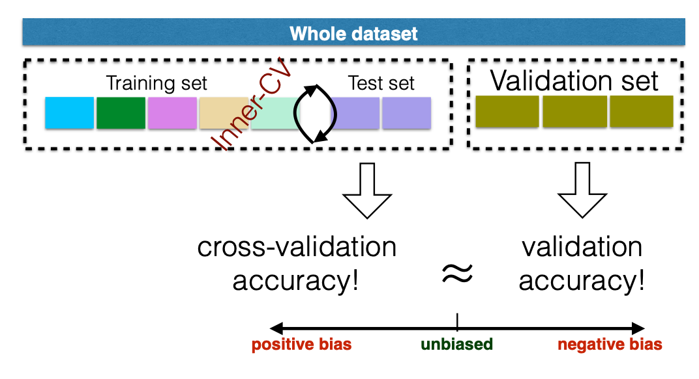
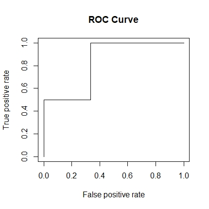
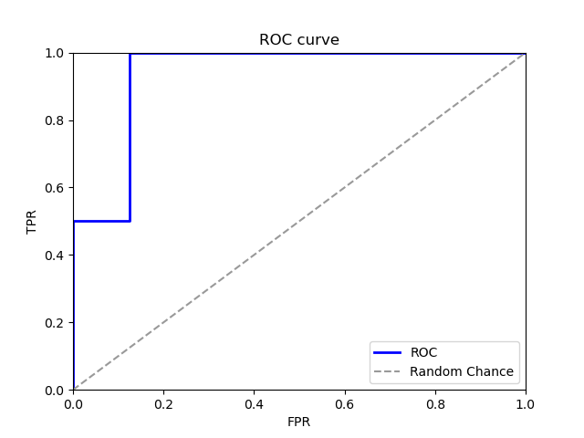

# 1.5 模型评估

为了衡量不同模型的效果，我们通常需要在测试数据利用特定的评价标准进行评价。那么我们需要定义用什么数据进行测试，也就是如何进行数据划分；用什么指标进行模型评估，也就是模型评价指标。

## 1\) 数据划分模式

### 1a\) 训练集、验证集、测试集

当数据比较充分时，我们将数据集按一定比例进行随机划分，将数据集划分成训练集（train set）、验证集（validation set）和测试集（test set），这种方法也称留出法。



* 训练集：用于训练模型。
* 验证集：因为机器学习模型涉及很多超参数，我们可以通过验证集评估模型，根据验证集效果获得最佳的模型超参数。
* 测试集：使用测试集确认模型效果，包括泛化能力。

数据划分要遵守几个要点：

* 训练/验证集的划分要尽可能保持数据分布的一致性，避免因为数据划分过程引入额外的偏差而对最终结果产生影响。
* 训练集太小，会产生较大的偏差（high bias），过小的数据集不适合进行留出法划分。

### 1b\) 交叉验证

交叉验证可以被用于在训练集中再随机划分出一部分验证集用于挑选模型的参数，也可以用于直接评估模型的表现。

对于非常大的数据集，将数据集单独拆分为训练集和测试集就足够来评估模型性能。但是，对于小型数据集，测试样本仅代表一小部分未来预测中可能的样本，即对于小数据集，划分出的测试集可能因为样本数过少而不具有代表性。

* **K-fold Cross-validation**

在**K折交叉验证**中，数据集被均匀地划分为$$k$$个部分（folds）。在每轮验证中，在剩余的$$\frac{k-1}{k}$$部分上进行训练，并在剩下的一个fold上进行测试。

K折交叉验证确保训练样本和测试样本之间没有重叠，K轮结束后，每个样本会被设置为测试样品一次。最后，模型平均表现是在 $$k$$轮次中计算指标的平均值得到的。


* **Leave-one-out Cross-validation**

LOO留一法是特殊的K折交叉验证，即k=m（m为样本总数量），就是说每次进行只留下一个样本用作测试集，其余m-1全为训练集，进行m次训练，取m次的评估结果的平均值进行模型选择。

LOO的好处在于,不受样本随机划分带来的偏差，往往被认为比较准确，避免的数据的浪费,但是同时也拥有了更高的计算开销。

### 1c\) 自助法

给定包含m个样本的数据集D，我们对它进行采样产生数据集 D′：每次随机从D中挑选出一个样本，将其拷贝放入D′, 然后再将该样本放回初始数据集D中，使得该样本在下次采样时仍有可能被采样到；这个过程重复执行m次后，我们就得到可包含m个样本数据的数据集D′,这就是自助采样的结果。

样本在m次采样中始终不被采到到概率为

$$
lim_{m\to\infty} (1-\frac{1}{m})^m \to \frac{1}{e} \approx 0.368
$$

初始数据集D中约有36.8%的样本未出现在采样数据集D′中。于是我们可将D′ 用作训练集，D-D′作为测试集。

自助法在数据集较小，难以有效划分训练/测试集时很有用，但是，自助法改变了初始数据集的分布，这会引入估计偏差，所以在数据量足够时，一般采用留出法和交叉验证法。

### 1d\) 划分数据的python函数

| 方法| 含义 | python function |
| :--- | :--- | :--- |
| 分层抽样 | 根据设置的比例参数将每一组数据分层采样，所谓的分层采样就是保持在每一组划分后train和test中类别之间的比例与划分前的类别之间的比例相同。 | sklearn.model_selection.StratifiedShuffleSplit |
| 随机有放回的抽样 | 测试集的样本从训练集中有放回的抽取。也就是说不同的train/test可能test的样本出现重复。 | sklearn.model_selection.ShuffleSplit |
| K折交叉验证| 把数据集排成一串，然后依次按照元素顺序分割成K份子集，然后每个子集充当一次测试集，这样可以使得每个样本都在测试集中出现。 | sklearn.model_selection.KFold,sklearn.model_selection.StratifiedKFold |
| 留一法| 数据集中取一个样本留给测试集。 | from sklearn.model_selection.LeaveOneOut |
 
## 2\) 模型评价
 
### 2a\) Confusion matrix

最常用的评估分类模型表现的方法是构建一个[confusion matrix](https://en.wikipedia.org/wiki/Confusion_matrix).

Confusion matrix会总结模型正确和错误分类的样本数量，并将预测的样本分成如下四类：

|  |  | 真实值 | 真实值 | 总数 |
| :--- | :--- | :--- | :--- | :--- |
|  |  | p\(positive\) | n\(negative\) |  |
| 预测值 | p' | 真阳性（TP） | 伪阳性（FP） | P' |
| 预测值 | n' | 伪阴性（FN） | 真阴性（TN） | N' |
|  | 总数 | P | N |  |

真阳性（TP）:正确的肯定，诊断为有，实际上也有癌症。

伪阳性（FP）:错误的肯定，诊断为有，实际上却没有癌症。第一型错误。

真阴性（TN）:正确的否定，诊断为没有，实际上也没有癌症。

伪阴性（FN）:错误的否定，诊断为没有，实际上却有癌症。第二型错误。

我们可以通过python函数获得TP，FP,TN,FN。

```python
from sklearn.metrics import confusion_matrix
y_true=[0, 1, 0, 1]
y_pred=[1, 1, 1, 0]
tn, fp, fn, tp = confusion_matrix(y_true,y_pred ).ravel()
# 输出
(tn, fp, fn, tp)
(0, 2, 1, 1)
```

### 2b\) 不同评价指标

* **Accuracy \(0 ~ 1\)** 

summarizes both positive and negative predictions, but is biased if the classes are imbalanced:

$$\text{Accuracy} = \frac{TP + TN}{TP + TN + FP + FN}$$

```python
from sklearn.metrics import accuracy_score
y_true=[0, 1, 0, 1]
y_pred=[1, 1, 1, 0]
accuracy_score(y_true, y_pred)
# 输出
0.25
```

* **Recall/sensitivity \(0 ~ 1\)**

summarizes how well the model finds out positive samples:

$$\text{Recall/Sensitivity} = \frac{TP}{TP + FN}$$

```python
import numpy as np
from sklearn.metrics import recall_score
y_true=[0, 1, 0, 1]
y_pred=[1, 1, 1, 0]
recall=recall_score(y_true, y_pred, average='macro')
# 输出
recall
0.25
```

* **specificity \(0 ~ 1\)**

真阴性率（TNR）, 又称为 特异度

$$\text{Specificity} = \frac{TN}{FP + TN}$$

```python
from sklearn.metrics import confusion_matrix
y_true=[0, 1, 0, 1]
y_pred=[1, 1, 1, 0]
tn, fp, fn, tp = confusion_matrix(y_true,y_pred ).ravel()
specificity=tn/(fp+tn)
# 输出
specificity
0.0
```

* **Precision/positive predictive value \(PPV\)  \(0 ~ 1\)** 

summarizes how well the model finds out negative samples:

$$\text{Precision/Positive Predictive Value} = \frac{TP}{TP + FP}$$

```python
import numpy as np
from sklearn.metrics import precision_score
y_true=[0, 1, 0, 1]
y_pred=[1, 1, 1, 0]
precision=precision_score(y_true, y_pred, average='macro')
# 输出
precision
0.16666
```

* **F1 score \(0 ~ 1\)** 

balances between positive predictive value \(PPV\) and true positive rate \(TPR\) and is more suitable for imbalanced dataset:

$$\text{F1 score} = 2 \frac{PPV \cdot TPR}{PPV + TPR}$$

```python
import numpy as np
from sklearn.metrics import f1_score
y_true=[0, 1, 0, 1]
y_pred=[1, 1, 1, 0]
f1_score=f1_score(y_true, y_pred, average='macro')
# 输出
f1_score
0.2
```

* **Matthews correlation coefficient \(MCC\) \(-1 ~ 1\)** 

another metric that balances between recall and precision:

$$\text{MCC} = \frac{TP \times TN - FP \times FN} {(TP + FN)(TP + FP)(TN + FP)(TN + FN)}$$

### 2c\) ROC曲线

有时一个固定的cutoff不足以评估模型性能。 Receiver Operating Characterisic（ROC）曲线可以评估模型的表现。 ROC曲线对于类别不平衡问题也有比较好的评估。

ROC曲线下面积（AUROC）是一个单值，它总结了不同截止值下的模型平均表现，常常用于报告模型的分类表现。AUROC接近于1，可以认为模型的分类效果很好。

ROC曲线（Receiver Operation Characteristic Cureve），描述TPR和FPR之间的关系。TPR和FPR之间是成正比的，TPR高，FPR也高。x轴是FPR，y轴是TPR。



**(1) ROC曲线的计算原理**

* **分类阈值**，即设置判断样本为正例的阈值thr
> 如果某个逻辑回归模型对癌症分类进行预测时返回的概率为 0.9995，则表示该模型预测这个样本非常可能是癌症样本。相反，在同一个逻辑回归模型中预测分数为 0.0003 的另一个样本可能不是癌症样本。那如果某样本的预测分数为0.6呢？为了将逻辑回归值映射到二元类别，您必须指定分类阈值（也称为判定阈值）。如果值高于该阈值，则表示“癌症”；如果值低于该阈值，则表示“正常人”。人们往往会认为分类阈值应始终为 0.5，但阈值取决于具体问题，因此您必须对其进行调整。

* **TPR**，预测为1，且预测对了的数量，占真实值为1的数据百分比，即召回率。根据混淆矩阵我们可以知道，TPR=TP/(TP+FN)。

* **FPR**，预测为1，但预测错了的数量，占真实值不为1的数据百分比。根据混淆矩阵我们可以知道，FPR=FP/(TN+FP)。

ROC曲线是根据在不同分类阈值下计算得到TPR和FPR，然后得到一系列的成对的TPR和FPR。我们以下面的数据为例进行讲解。

* 训练数据

| SampleID | Expression\_of\_miR\_1 | Expression\_of\_miR\_2 | Expression\_of\_miR\_3 | Type |
| :--- | :--- | :--- | :--- | :--- |
| 1 | 12 | 55 | 74 | cancer |
| 2 | 87 | 44 | 46 | normal |
| 3 | 70 | 23 | 56 | normal |
| 4 | 74 | 35 | 69 | normal |
| 5 | 46 | 43 | 59 | cancer |
| 6 | 58 | 31 | 90 | cancer |
| 7 | 55 | 40 | 30 | normal |
| 8 | 33 | 50 | 76 | cancer |
| 9 | 60 | 20 | 34 | normal |
| 10 | 50 | 22 | 11 | normal |
| 11 | 70 | 50 | 60 | cancer |
| 12 | 22 | 60 | 90 | cancer |
| 13 | 68 | 10 | 9 | normal |
| 14 | 90 | 30 | 20 | normal |
| 15 | 10 | 40 | 39 | cancer |

* 测试数据

| SampleID | Expression\_of\_miR\_1 | Expression\_of\_miR\_2 | Expression\_of\_miR\_3 | Type |
| :--- | :--- | :--- | :--- | :--- |
| 16 | 78 | 50 | 23 | normal |
| 17 | 50 | 60 | 82 | cancer |
| 18 | 70 | 33 | 51 | normal |
| 19 | 81 | 31 | 12 | normal |
| 20 | 44 | 11 | 5 | normal |
| 21 | 20 | 56 | 44 | cancer |
| 22 | 51 | 31 | 17 | normal |
| 23 | 40 | 11 | 4 | normal |
| 24 | 30 | 60 | 57 | normal |
| 25 | 81 | 13 | 24 | normal |

其中，normal记为0，cancer记为1。

我们利用逻辑回归进行分类，我们可以计算不同分类阈值下的混淆矩阵值，如下。

| thr |TN | FP |FN | TP | TPR | FPR |
| :--- | :--- | :--- | :--- | :--- |:--- |:--- |
| 2.94626162e-12 | 0 | 8 | 0 | 2 |1 | 1 |
| 2.75991801e-10 | 2 | 6 | 0 | 2 |1 |0.75 |
| 6.45221482e-10 | 3 | 5 | 0 | 2 |1 |0.625 |
| 1.15382884e-09 | 4 | 4 | 0 | 2 |1 |0.5 |
| 1.34044095e-05 | 5 | 3 | 0 | 2 |1 |0.375 |
| 4.10114369e-04| 6 | 2 | 0 | 2 |1 |0.25 |
| 6.94146227e-04 | 7 | 1 | 0 | 2 |1 |0.125 |
| 9.99999883e-01 | 7 | 1 | 1 | 1 |0.5 |0.125 |
| 9.99999989e-01 | 8 | 0 | 1 | 1 |0.5 |0.0 |
| 9.99999993e-01 | 8 | 0 | 2 | 0 |0.0 |0.0 |

我们可以根据TPRFPR，画出ROC曲线。

**(2) ROC曲线的python实现**

另外我们可以通过python函数完成这个过程。

```python
import numpy as np
import matplotlib.pyplot as plt
from sklearn.metrics import roc_curve, auc
# 数据加载
x=np.array([[12, 87, 70, 74, 46, 58, 55, 33, 60, 50, 70, 22, 68, 90, 10],
[55, 44, 23, 35, 43, 31, 40, 50, 20, 22, 50, 60, 10, 30, 40],
[74, 46, 56, 69, 59, 90, 30, 76, 34, 11, 60, 90,  9, 20, 39]])
x_=np.array([[78, 50, 70, 81, 44, 20, 51, 40, 30, 81],
[50, 60, 33, 31, 11, 56, 31, 11, 60, 13],
[23, 82, 51, 12,  5, 44, 17,  4, 57, 24]])
y=np.array([1, 0, 0, 0, 1, 1, 0, 1, 0, 0, 1, 1, 0, 0, 1])
y_=np.array([0, 1, 0, 0, 0, 1, 0, 0, 0, 0])

X_train = x
X_test = x_
y_train = y
y_test = y_

#模型训练测试
log_reg = LogisticRegression()
log_reg.fit(X_train, y_train)
# 预测
y_predict=log_reg.predict(X_test)
proba=log_reg.predict_proba(X_test).T[1]
fpr, tpr, thresholds = roc_curve(y_test, proba)
roc_auc = auc(fpr, tpr)
# 输出AUC
roc_auc
0.9375
# 画ROC曲线
plt.plot(fpr, tpr, '-', color='b', label='ROC', lw=2)
plt.plot([0, 1], [0, 1], '--', color=(0.6, 0.6, 0.6), label='Random Chance')
plt.xlim([0, 1])
plt.ylim([0, 1])
plt.title('ROC curve')
plt.xlabel('FPR')
plt.ylabel('TPR')
plt.legend()
plt.show()
plt.close()
```
结果如下：



**(3) ROC曲线的R实现**

我们也可以通过R完成这个过程。

```R
library("ROCR")
#数据加载
X_train <- t(matrix(c(12, 87, 70, 74, 46, 58, 55, 33, 60, 50, 70, 22, 68, 90, 10,
                    55, 44, 23, 35, 43, 31, 40, 50, 20, 22, 50, 60, 10, 30, 40,
                    74, 46, 56, 69, 59, 90, 30, 76, 34, 11, 60, 90,  9, 20, 39),
                  byrow = TRUE, nrow = 3))
X_test <- t(matrix(c(78, 50, 70, 81, 44, 20, 51, 40, 30, 81,
                   50, 60, 33, 31, 11, 56, 31, 11, 60, 13,
                   23, 82, 51, 12,  5, 44, 17, 4, 57, 24),
                 byrow = TRUE, nrow = 3))
Y_train <- t(matrix(c(1, 0, 0, 0, 1, 1, 0, 1, 0, 0, 1, 1, 0, 0, 1),
                  byrow = TRUE, nrow = 1))
Y_test <- t(matrix(c(0, 1, 0, 0, 0, 1, 0, 0, 0, 0),
                   byrow = TRUE, nrow = 1))
#模型训练测试
X <- as.data.frame(cbind(X_train,Y_train))
logistic <- glm(V4 ~ ., data = X, family='binomial', control=list(maxit=100))
summary(logistic)
#预测
X_test <- as.data.frame(X_test)
predicted <- as.numeric(predict(logistic, X_test, type = 'response') > 0.5)
pred <- prediction(predicted, Y_test)
auc <- performance(pred, 'auc')@y.values
#输出auc
auc
0.9375
#画ROC曲线
roc <- performance(pred, "tpr", "fpr")
plot(roc, main = 'ROC Curve')
```

结果如下：


## 3\) Homework

1.按照本章给出的教程，利用LR对给定数据集BreastCancer进行训练，并得到ROC曲线，将脚本和ROC图提交一个word/PDF文档。

> 作业要求： 
> 1\) BreastCancer文件，可在[这里](https://cloud.tsinghua.edu.cn/f/61b944d6d6334f6092f5/)下载。数据集包括9个特征，两种类别，良性（benign）和恶性（malignant）。 如需了解更多关于BreastCancer数据集信息，可参考mlbench的文档。 
> 2\) 需进行数据空缺值填充(利用0填充空缺)
> 3\) 需划分训练集和测试集，训练集为前500个样本，测试集为后199个样本。
> 4\) 模型为LR。
